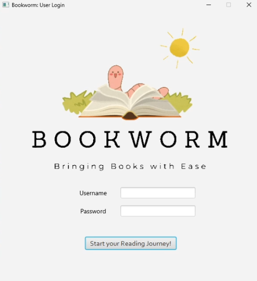
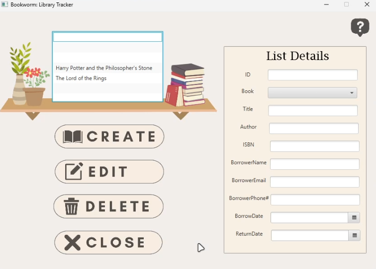

# Bookworm

Bookworm is a library management system designed to help users track books, borrowers, and lending activities. It provides a graphical user interface (GUI) for managing library records and a backend microservice for data persistence and RESTful API access. The system allows users to create, edit, delete, and view library tracker records, including details such as book title, author, ISBN, borrower information, and borrowing/return dates.

 
<b>Figure 1:</b> Bookworm login screen

 
<b>Figure 2:</b> Bookworm main interface

## Main Features
- Track books and their lending status.
- Manage borrower details (name, email, phone).
- CRUD operations for library records.
- GUI application for user interaction.
- RESTful API for backend operations.

## Technologies

### Backend
- Java
- Spring Boot (REST API, Dependency Injection, Service Layer)
- Maven (Build and dependency management)

### Frontend (Desktop GUI)
- Java (Controllers, application logic)
- JavaFX (GUI framework)
- FXML (UI layout)
